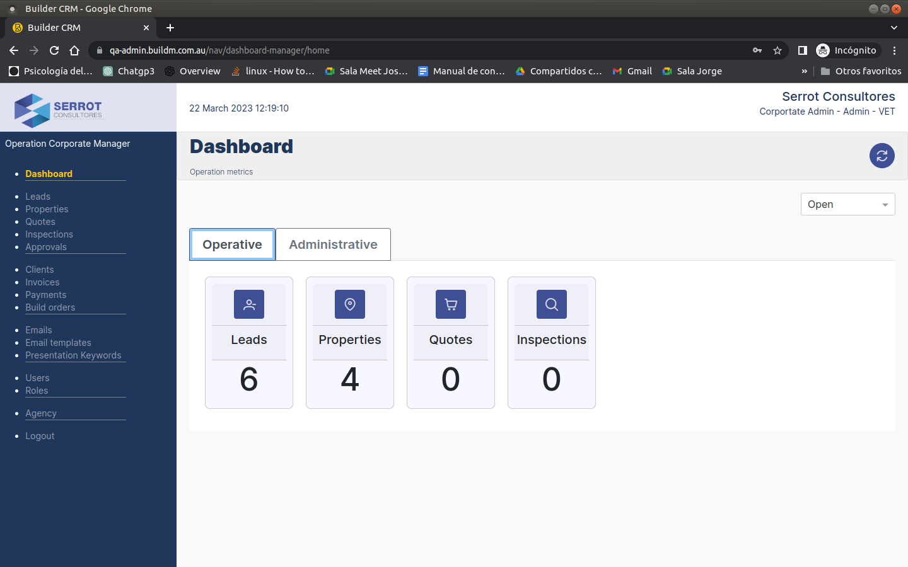
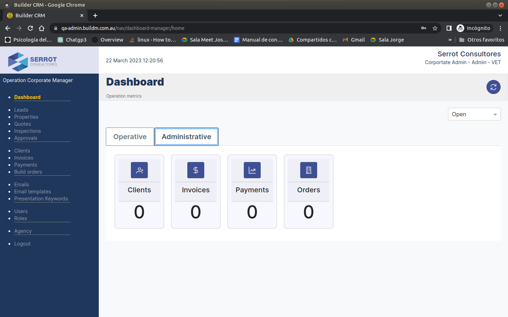

# Main Dashboard

### Welcome to Build CRM

> As we can see in the image we can see **the main dasboard interface of the system**, which contains the following elements: the main menu and two tabs, the first one shows the Operational part, and this in turn contains cards with the modules (**Leads, Properties, Quotes, Inspections**) and the second tab shows the Administrative part and this in turn contains cards with the modules (**Customers, Invoices, Payments, Orders**).

### Dasboard Operative

::: info
Operational part, and this in turn contains cards with the modules (**Leads, Properties, Quotes, Inspections**).
:::

### Dasboard Administrative

::: info
Administrative part, and this in turn contains cards with the modules (**Customers, Invoices, Payments, Orders**).
:::

### The main menu

> As we can see in the image we can see **the main dasboard interface of the system**, which contains the following elements: the main menu and two tabs, the first one shows the Operational part, and this in turn contains cards with the modules (**Leads, Properties, Quotes, Inspections**) and the second tab shows the Administrative part and this in turn contains cards with the modules (**Customers, Invoices, Payments, Orders**).

