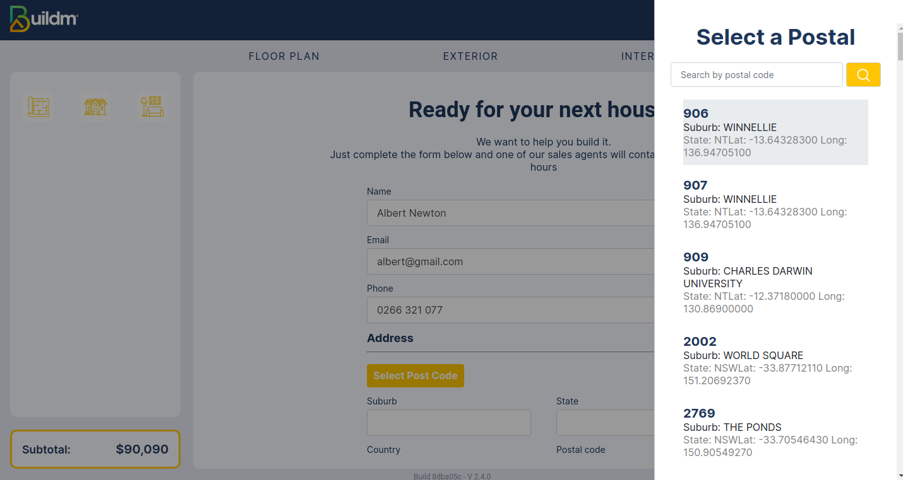
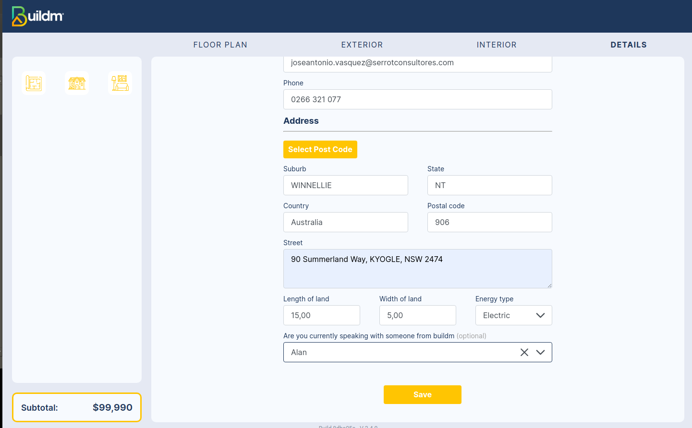
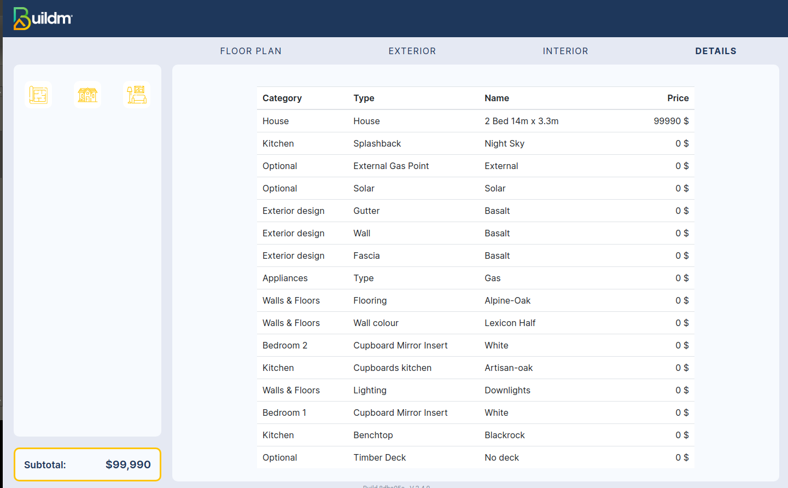
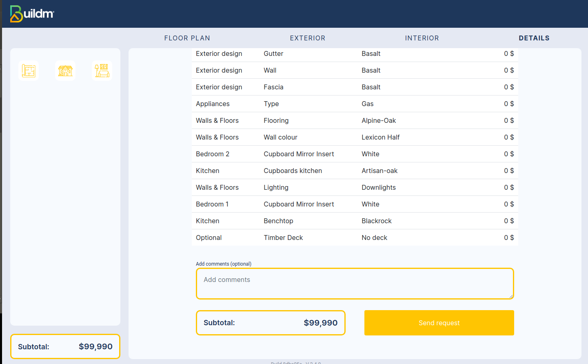
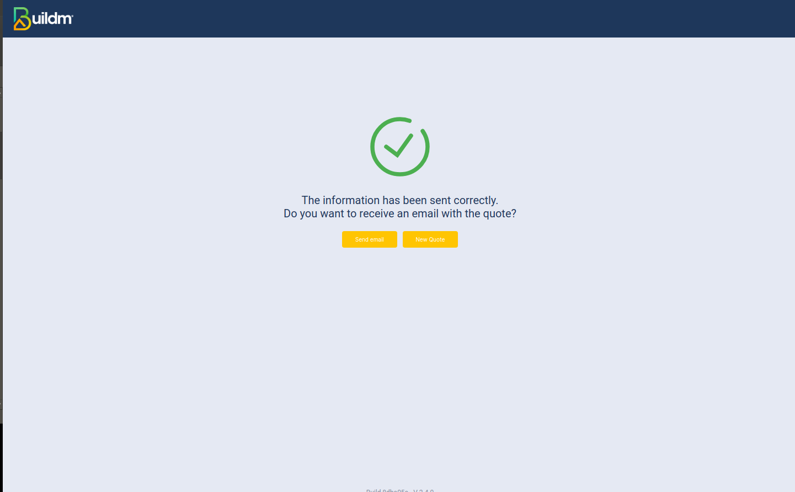
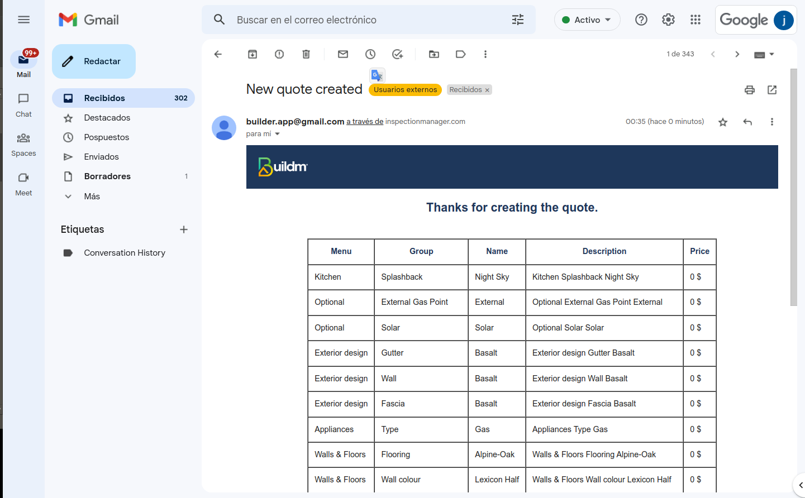

# Details

## Welcome to the Details page

>Interface that helps us to send the quotation information to the sales agent by email by filling out the form in the section details.

::: info <Badge type="info" text="DETAILS" />
---

 **Description:**
 The Build Quote interface helps us send the quote information to the sales agent via email by completing the form in the details section. With this tool, we can efficiently generate quotes and quickly send them to our prospects. Save time and increase productivity with Build Quote!

:::

>### Details Form
---

> In this interface you must enter personal information to the details form, filling all the fields.

---

>### Quotation details

----

> ---

> This interface displays the final amount of the previously selected quotation with the details of the items included
---

> ### Send Form registration by mail

---

> This interface shows the final step of filling out the form and its subsequent submission.
 Click the send email button
---

> ###  Email Verification

---
>
Verification of receipt of mail with the information of the quote.