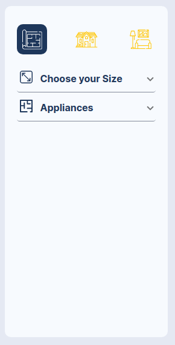
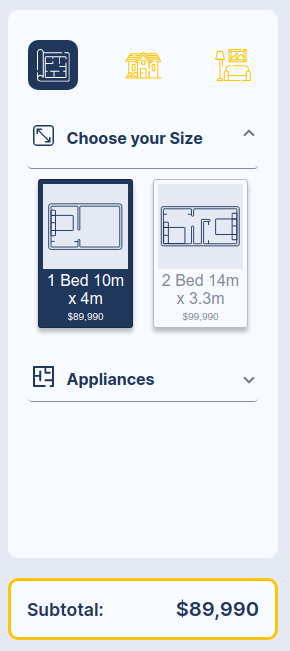
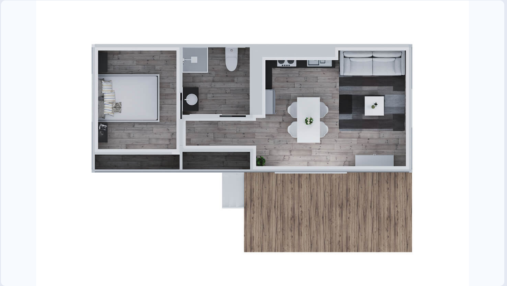
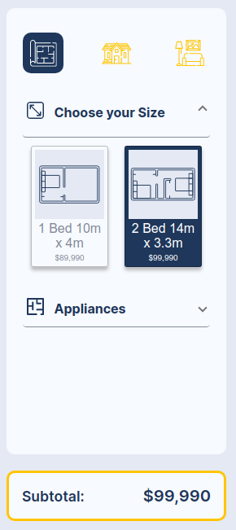
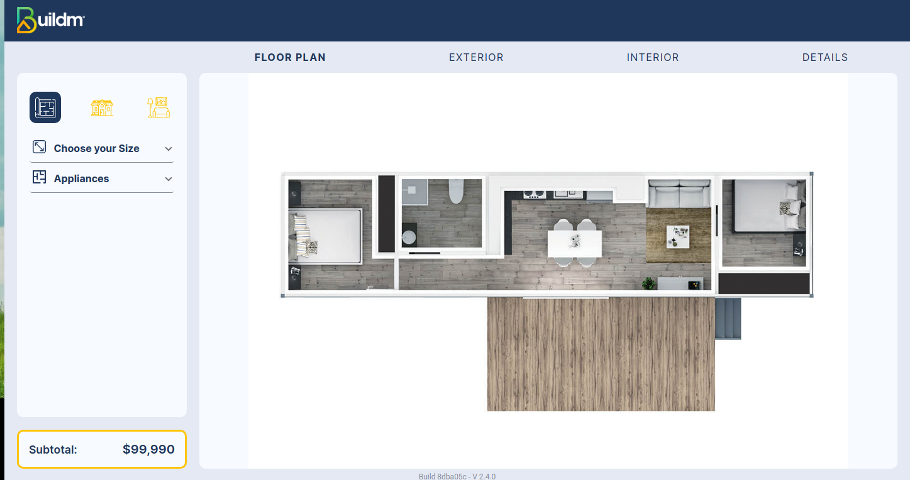
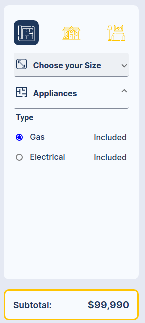

# Floor Plan

## Welcome to the Floor Plan page

>Welcome to the Floor Plan interface, in this section of the system you will be able to select the floor plan of your choice according to your budget, you can also include the type of appliances with the options electric or gas.

### Menu Menu

::: info <Badge type="info" text="FLOOR PLAN  - MAIN MENU " />
---

 **Menu description:**

1. **Icons**: ["Floor Plan", "Exterior", "Interior"].
2. **Dropdown**: "Choose your Size" two cards, the first with the description "1 Bed 10m x 4m $89,990", the second "2 Bed 14m x 3.3m $99,990". 
3. **Dropdown**: "Appliances Type "Gas, Electrical".
4. **Subtotal:** sub total indicates the price of the selection
:::

---

### Floor Plan menu Choose you size Plan 1 Bed 10m x 4m

---
### Floor Plan 1 Bed 10m x 4m

### Floor Plan menu Choose you size Plan 2 Bed 14m x 3.3m

---
### Floor Plan 2 Bed 14m x 3.3m
---

---

### Floor Plan menu Appliances

---

>In the Floor plan view, the user can select the floor plan models that fit his needs in a simple and friendly way, when selecting any of the floor plans in the following module influences the selection because it is maintained and both inside and outside the images are different when changing colors, see the bathroom, living room etc.

