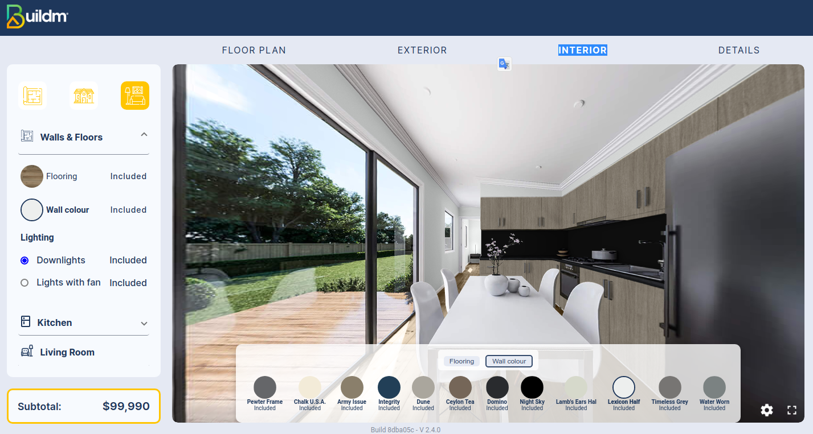

# Interior

## Welcome to the Interior page

>Welcome to the Interior interface, In the Interior module, we can select to change the color for the floor and walls in the kitchen, living room, bathroom, bedroom, etc.

### Main Menu

::: info <Badge type="info" text="INTERIOR  - MAIN MENU " />
---

 **Menu description:**

1. **Icons**: ["Floor Plan", "Exterior", "Interior"].
2. **Walls & Floors**: "We can select the paint color for the wall, floors.
3. **Kitchen***: " We can select to change the color cupboards Kitchen, Benchtop, Splashback.
4. **Living Room**: n the sample image you can see the color changes, the floor and walls that were previously selected, it applies to the **Bathroom** and the **Bedroom**.

:::

---

# Option  1 Bed 10m x 4m

## Interior design  Option  1 Bed 10m x 4m

---

### Walls & Floors

---

> **Without color:** In the image we can see that we have the option to change the color of the floor and wall, with various colors offered by the application.

---

---

> **Color selection:** as shown in the image we can change the color of the wall and the floor by clicking on the colors shown at the bottom.

### Cupboards Kitchen

---

> **Without color:** In the image we can see that we have the option to change the color of the Cupboards Kitchen, with various colors offered by the application.

---

---

> **Color selection:** as shown in the image we can change the color of the wall and the floor by clicking on the colors shown at the bottom.

---

### Kitchen Benchtop

---

> **Without color:** In the image we can see that we have the option to change the color of the Bechtop Kitchen, with various colors offered by the application.

---

---

> **Color selection:** as shown in the image we can change the color of Benchtop by clicking on the colors shown at the bottom.

### LivingRoom

---

>In the image you can appreciate the change of the previously selected colors, showing how the livingroom would look like.
### BathRoom

---

> In the image you can appreciate the change of the previously selected colors, showing how the Bathroom would look like.

---

### BedRoom

---

> In the image we can appreciate how the room looks like without the selection of the Cupboard mirror, knowing that it is an optional element.

### BedRoom Mirror

> In the image we can see how the room looks like with the selection of the Cupboard Mirror. 
---

# Option  2 Bed 14m x 3.3m

## Interior design Option  2 Bed 14m x 3.3m

---

### Walls & Floors

---

> **Without color:** In the image we can see that we have the option to change the color of the floor and wall, with various colors offered by the application.

---

---

> **Color selection:** as shown in the image we can change the color of the wall and the floor by clicking on the colors shown at the bottom.

### Cupboards Kitchen

---

> **Without color:** In the image we can see that we have the option to change the color of the Cupboards Kitchen, with various colors offered by the application.

---

---

> **Color selection:** as shown in the image we can change the color of the Cupboards Kitchen by clicking on the colors shown at the bottom.

### Benchtop Kitchen

---

> **Without color:** In the image we can see that we have the option to change the color of the Benchtop, with various colors offered by the application.

---

### Splashback Kitchen

---

> **Without color:** In the image we can see that we have the option to change the color of the SplashBack, with various colors offered by the application.

---

### LivingRoom

---

> In the image you can appreciate the change of the previously selected colors, showing how the livingroom would look like.

### BathRoom

---

> In the image you can appreciate the change of the previously selected colors, showing how the Bathroom would look like.

---

### BedRoom 1

---
> In the image we can appreciate how the room looks like without the selection of the Cupboard mirror, knowing that it is an optional element.
> 
 
### BedRoom 1 Mirror

---
> In the image we can see how the room looks like with the selection of the Cupboard Mirror. 

### BedRoom 2

---
> In the image we can appreciate how the room looks like without the selection of the Cupboard mirror, knowing that it is an optional element.

### BedRoom 2 Mirror

---
> In the image we can see how the room looks like with the selection of the Cupboard Mirror. 
