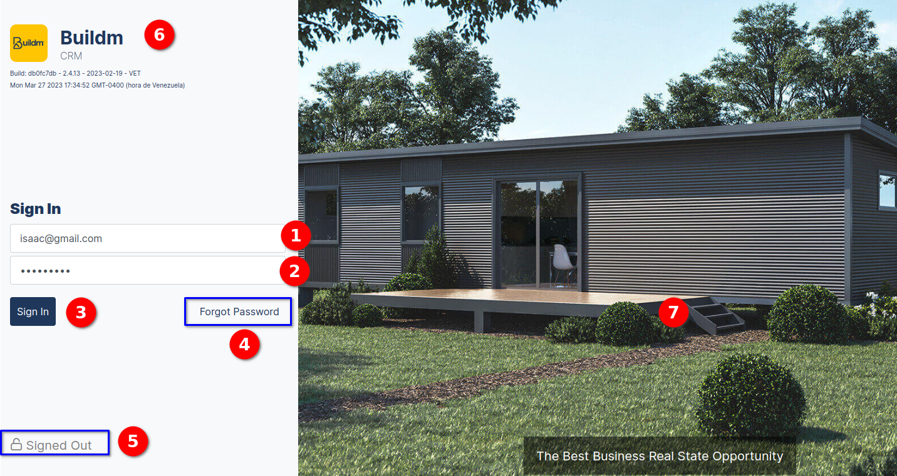
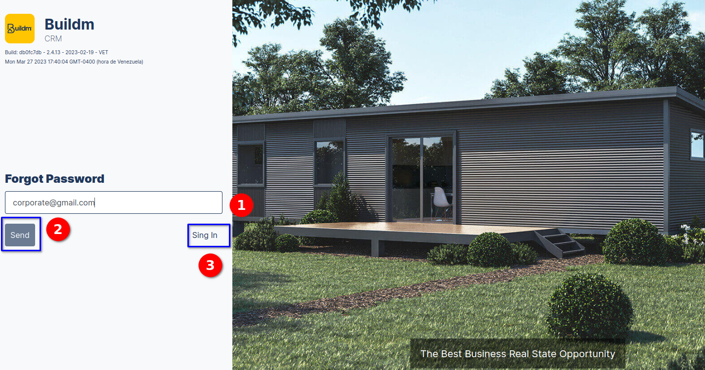

# Quickstart Guide

### Login

> To enter the buildm system, we must type the following web address to the browser: **[https://admin.buildm.com.au/landing-manager/login](https://admin.buildm.com.au/landing-manager/login)**. then the following interface will be displayed to enter the application.

::: info <Badge type="info" text="INFO" />
---
**Login view**.
 * **interface elements login view:**
  

    1. User field.
    2. Password field.
    3. Login button
    4. Forgot password.
    5. Authenticated", "Signed out " status.
    6. Logo and system name, version number.
    7. Image models of the houses

:::

---

### Forgot Password

>In the image we can enter the interface to recover the password in case of forgotten password, **the user must enter the email address in the forgotten password field, and press the send button**, then the system will send a message.

::: info <Badge type="info" text="INFO" />
---
**forgot password view**.
 * **interface elements forgot password:**
  

    1. Email field
    2. send button "the email that will receive the option to recover the password". 
    3. Sing in link
:::

### Forgot Password send message

>Then the system displays the following message **We have sent you a verification link to your email. Please enter the link to continue with the password recovery process**.

::: info <Badge type="info" text="INFO" />
---

The message with the procedure to recover the password.
:::
