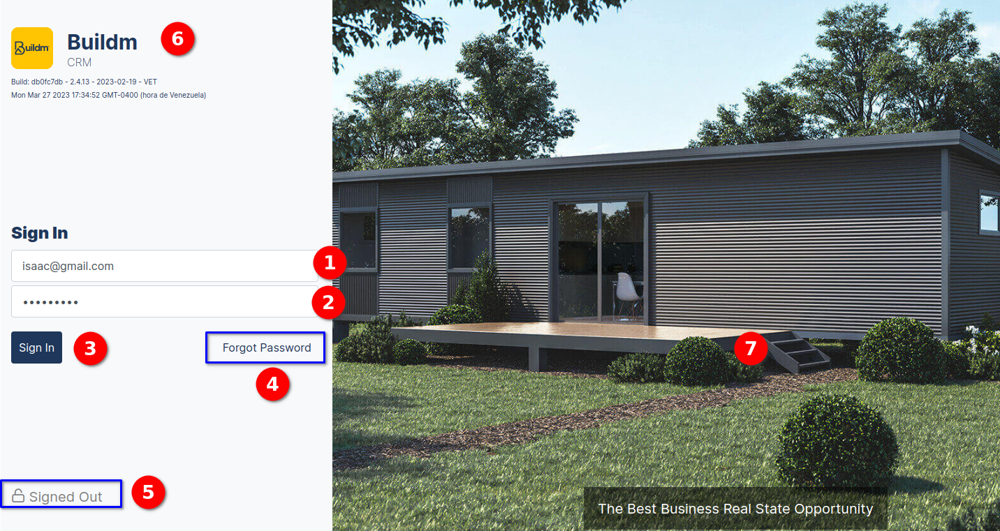
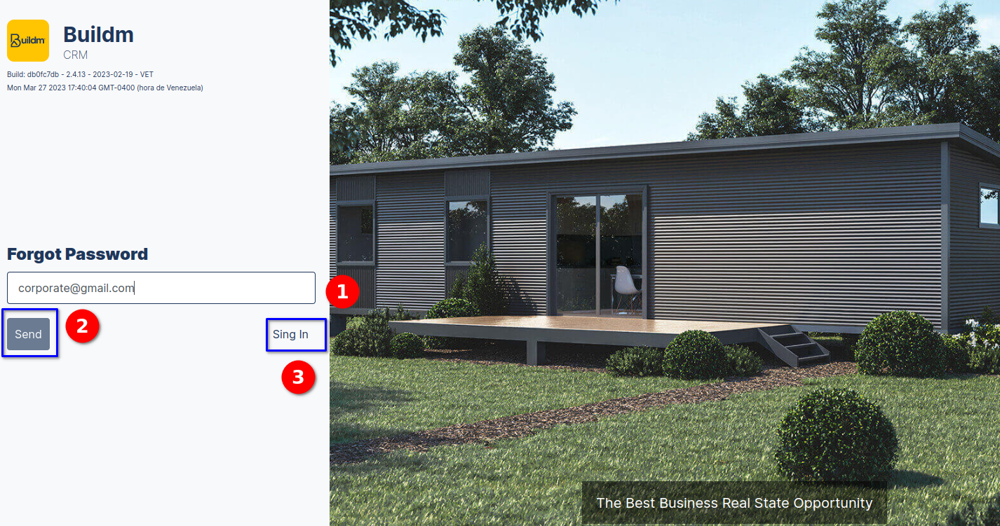
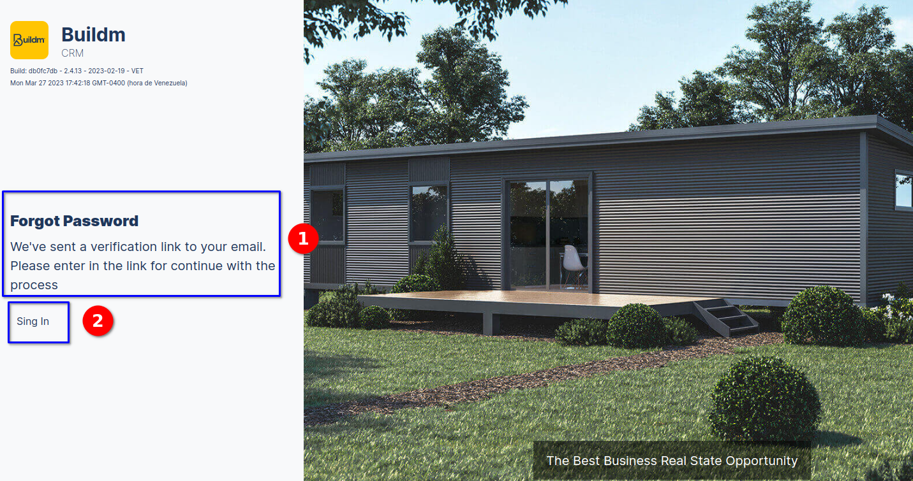

# Quickstart Guide

### Login

> To enter the buildm system, enter the following web address in the browser:**[https://admin.buildm.com.au/landing-manager/login](https://admin.buildm.com.au/landing-manager/login)**. The following login interface will then be displayed to access the application.

::: info <Badge type="info" text="LOGIN VIEW" />
---

**Components of the Login View Interface:**
  
1. User field.
2. Password field.
3. Sign In button
4. Forgot password.
5. Authenticated", "Signed out " status.
6. Logo and system name, version number.
7. Image model of the houses.

:::

---

### Forgot Password

>In the image we can enter the interface to recover the password in case of forgotten password, **the user must enter the email address in the forgotten password field, and press the send button**, then the system will send a message.

::: info <Badge type="info" text="FORGOT PASSWORD VIEW" />
---

  **Components of the Login View Interface:**
  

1. Email field.
2. send button "the email that will receive the option to recover the password". 
3. Sing in link.
:::

### Forgot Password send message

>Then the system displays the following message **We have sent you a verification link to your email. Please enter the link to continue with the password recovery process**.

::: info <Badge type="info" text="FORGOT PASSWORD MESSAGE" />
---

 1. The message with the procedure to recover the password.
 2. Sign in link, return to login view
:::
