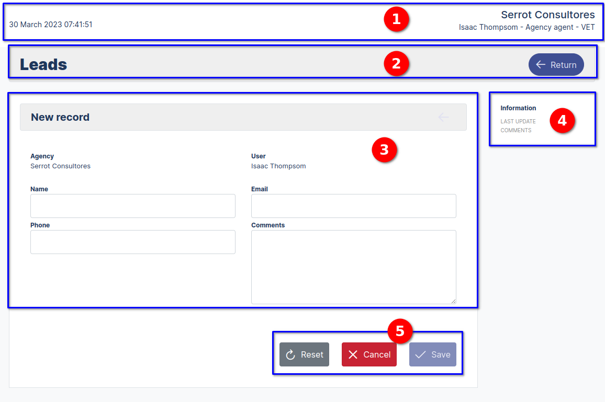
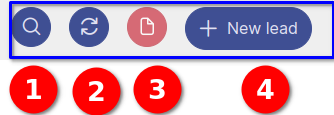
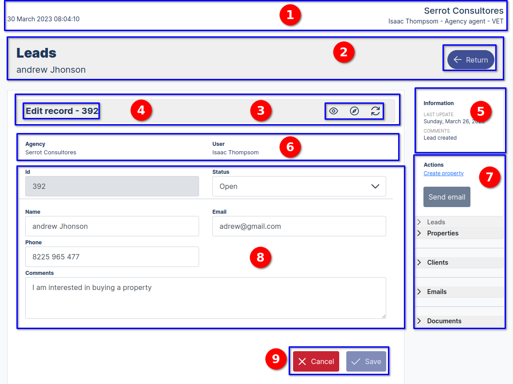

# Agency agent user

## Welcome to the Agency Agent user page

>Welcome to the **Agency Agent user** section, this manual is designed to be easy to follow and use through detailed explanations, illustrations and practical examples, we will provide you with a step by step guide on how to use the Builder CRM system, in this section we will work on the Agency Agent user workflow through the following modules **(Leads, Properties, Emails, Users)**.

### Agency agent User Menu

::: info <Badge type="info" text="AGENCY AGENT MENU - LEADS" />
---

 **Menu description:**

1. **Agency logo and name**
2. **User type description**
3. **Navigation menu with modules (Leads,Properties,Emails,Users,logout)**
:::

---

### Leads Dashboard module

---

---

>The **Leads Dashboard** panel interface features several components that make it easy to use and very convenient. At the top is the top bar, which shows the name of the agency and the authenticated user, along with the date and time. Below this is a frame with the name of the module and a refresh button that refreshes the data on the cards. Additionally, there is a dropdown menu that allows you to filter open, closed, or archived processes, making it easy to find specific information. There is also a tab that refers to the "Operational" part, which allows the user to quickly and efficiently access the relevant information. Finally, there are two Cards **("Leads" and "Properties")** that serve as links to their respective modules on the Dashboard. Overall, the interface is intuitive and easy to use, allowing the user agency agent to quickly and efficiently access the information they need.

---

::: info <Badge type="info" text="AGENCY MANAGER DASHBOARD" />

---

**Agency Agent User Dashboard**.

* **Interface elements Agency Agent User Dashboard:**

    1. Leads Card Property, has the function of displaying statistics and provides another way to navigate to the referred modules.
    2. The Operative tab indicates that the module belongs to the operative part of the process.
    3. Filter of the processes that are "open", "closed", "archived".
    4. Update the card information.
    5. Name of the agency and of the logged agent.
    6. Date data.
    7. Name of the module.
:::

---

### Create a new Lead

>To create a **new Lead** we go to the dashboard and navigate to **the button New Lead** by clicking on it, it directs us to the form view to register a new Lead..

---

---

::: info <Badge type="info" text="LEAD FORM REGISTER" />
---

**Lead Registration Form**.

* **Form interface components:**

    1. **Top bar, Agency name, authenticated user and user type, date and time**
    2. **Module name and return button:** Returns to the lead list view
    3. **Registration Form:** Name of the agency and user, fields name, email, phone, comments
    4. **Information:** Blog last update, comment
    5. **Reset, Cancel, Save buttons:** Reset, Cancel, Save buttons Reset: Clears the form,       cancel: Returns to the prospect list view, Save: Saves the form data.

:::

---

### Leads list view

>The list of Leads view contains the information through a table of the form records.

---

---

::: info <Badge type="info" text="LEAD LIST VIEW" />
---

**Leads List View**.

 **Interface components:**

1. **Name of the agency, authenticated user and type of user**.
2. **Date and time**.
3. **Name of the module, amount of registration and search, update, archive, New Lead buttons**.
4. **Shows current status:** open.
5. **Filters of interest:** ("All", "Interested", "Not interested", "Open to conversation")
   status: **("Open","Closed","Archived")**.
6. **Table with the following fields:** Presentation, Interested Party, name, Contact, Agency/Agent, Prospect Status.
7. **Actions:** Buttons **("Read","Edit","Upload","Archived")**.

:::

---

### Search, Update, Archive, New Lead buttons

>We have the buttons to perform different actions in the prospects module.

---

::: info <Badge type="info" text="BUTTONS TOPBAR" />
---

**Leads List View**.

1. Search button: Search for prospects.
2. Refresh button: Refreshes the data in the table.
3. Archive Button: Changes the status and disables it so as not to show the record.
4. New prospect button: opens the registration form

:::

---

### The actions button read, edit, upload , archive

>These buttons perform the actions of reading, editing, archiving, uploading files, in the forms of the different views that are enabled by clicking on each button..

---

---
::: info <Badge type="info" text="ACTIONS BUTTONS" />
---

**Leads List View actions buttons**.

1. **The actions buttons** read, edit, upload , archive.
2. Information of the last update with the date and time of the record.

:::

---

### Read Button

>Displays the form in reading mode, to see the information of the registered prospectus in a preliminary way..

---

---

---

---

::: info <Badge type="info" text="LEAD FORM" />
---

**Leads List View**.

 **Interface components:**

 1. **Top bar, Agency name, authenticated user and user type, date and time**.
 2. **Module name and lead name**.
 3. **Edit, Refresh, Refresh, Lead ID buttonsLead code: Agency and user name, field name, email, phone, comments**.
 4. **Form with fields disabled in read mode**.
 5. **Information:** Last blog update, comment.
 6. **Auxiliary menu:** Allow to navigate to the system modules.
 7. **Back button**: Back to the prospect list view. form.
 8. **Agency name, authenticated user**. 9. 
 9. **Return button**: Returns to the Lead list view. form.

:::

---

### Navigation modules Properties and Emails

>In the Read view of the form we have some auxiliary panels that allow us to navigate to the Properties and mail forms by clicking on the blue button. 

::: info <Badge type="info" text="LEAD FORM" />
---

**Leads List View**.

 **Interface components:**

1. **In the Read form view we have auxiliary panels that allow us to navigate to the Properties and mail forms by clicking on the blue button**.

:::

---

### Edit Button   

>Edit button, directs to the form in the edit view.

---

---

---

::: info <Badge type="info" text="LEAD EDIT FORM" />
---

**Leads  Edit Form View**.

 Interface components:

 1. **Top bar, Agency name, authenticated user and user type, date and time**.
 2. **Module name and back button:** Returns to lead list view.
 3. **Read, Refresh, Refresh buttons:** Agency and user name, fields name, email, phone, comments.
 4. **Lead ID:** Lead code.
 5. **Information:** Blog last update, comment.
 6. **Agency name, agent name:** Agency name and logged in agent name.
 7. **Modules menu:** Secondary menu to access the other modules.
 8. **Registration Form:** Main form.
 9. **Cancel, Save buttons:**  Cancel, Save buttons :  Cancel: Returns to the prospect list view, Save: Saves the form data.
:::

---

### Upload Archive   

>Upload button, shows the form in read mode, enabling a button for uploading attachments such as documents, images, etc.

---

---

### Archive Button  

>Archive button its function is to archive the record in order not to be shown in the table, it must be taken into account that it only works with users with higher privileges.

---

# Properties Dashboard Module

## Welcome to the properties page

>Welcome to the section **Property Module**, in this module you will work with the information of the properties that the prospect has where you will detail the highlights of your property..

### Agency agent User Menu - Properties module

::: info <Badge type="info" text="AGENCY AGENT MENU - PROPERTIES" />
---

 **Menu description:**

1. **Properties module**
:::

---

### Welcome to the properties dashboard

---

---

::: info <Badge type="info" text="AGENCY AGENT MENU - PROPERTIES" />
---

**Lead Registration Form**.

* **Form interface components:**

 1. **Top bar, Agency name, authenticated user and user type, date and time**.
 2. **Module name, number of records, search buttons, update, archive, new property**.
 3. **Status:** Open.
 4. **Displayable**: with options open, closed, archived.
 5. **Table with the address of the contact's property**.
 6. **Action buttons** "Status open green color", Read, edit, upload, archive.

:::

---

### How to register a new Properties ?

>To create a **new Properties** we go to the dashboard and navigate to **the button New Properties** by clicking on it, it directs us to the form view to register a new Properties.

## Form to create a new property

---

---

---

::: info <Badge type="info" text="LEAD FORM REGISTER" />
---

**Lead Registration Form**.

* **Form interface components:**

    1. **Top bar, Agency name, authenticated user and user type, date and time**
    2. **Module name and return button:** Returns to the lead list view
    3. **Registration Form:** Name of the agency and user, fields name, email, telephone, comments
    4. **Information:** Blog last update, comment
    5. **Reset, Cancel, Save buttons:** Reset, Cancel, Save buttons Reset: Clears the form,       cancel: Returns to the prospect list view, Save: Saves the form data.

:::

---
