# Agency agent user

## Welcome to the Agency Agent user page

>Welcome to the **Agency Agent user** section, this manual is designed to be easy to follow and use through detailed explanations, illustrations and practical examples, we will provide you with a step by step guide on how to use the Builder CRM system, in this section we will work on the Agency Agent user workflow through the following modules **(Leads, Properties, Emails, Users)**.

### Agency agent User Menu

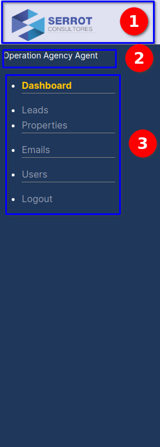

::: info <Badge type="info" text="AGENCY AGENT MENU - LEADS" />
---

 **Menu description:**

1. **Agency logo and name**
2. **User type description**
3. **Navigation menu with modules (Leads,Properties,Emails,Users,logout)**
:::

---

### Leads Dashboard module

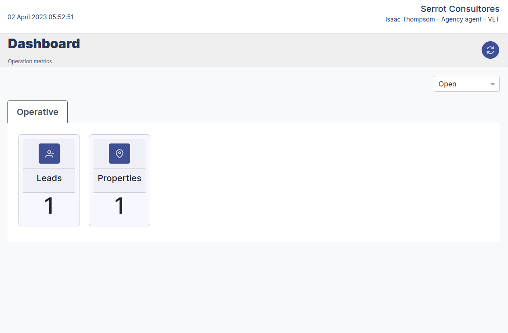

---
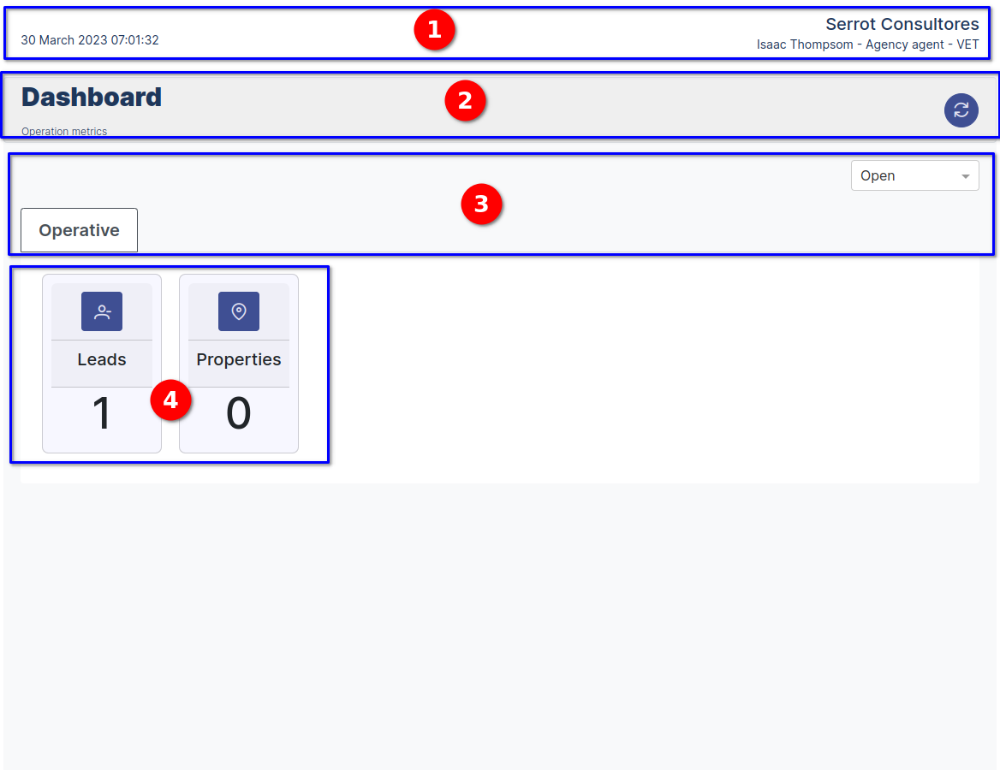

---

>The **Leads Dashboard** panel interface features several components that make it easy to use and very convenient. At the top is the top bar, which shows the name of the agency and the authenticated user, along with the date and time. Below this is a frame with the name of the module and a refresh button that refreshes the data on the cards. Additionally, there is a dropdown menu that allows you to filter open, closed, or archived processes, making it easy to find specific information. There is also a tab that refers to the "Operational" part, which allows the user to quickly and efficiently access the relevant information. Finally, there are two Cards **("Leads" and "Properties")** that serve as links to their respective modules on the Dashboard. Overall, the interface is intuitive and easy to use, allowing the user agency agent to quickly and efficiently access the information they need.

---

::: info <Badge type="info" text="AGENCY MANAGER DASHBOARD" />

---

**Agency Agent User Dashboard**.

* **Interface elements Agency Agent User Dashboard:**

    1. Leads Card Property, has the function of displaying statistics and provides another way to navigate to the referred modules.
    2. The Operative tab indicates that the module belongs to the operative part of the process.
    3. Filter of the processes that are "open", "closed", "archived".
    4. Update the card information.
    5. Name of the agency and of the logged agent.
    6. Date data.
    7. Name of the module.
:::

## Create a new Lead

---

::: info <Badge type="info" text="CREATE A NEW LEAD" />

---

To create a new lead, follow the steps below:

  1. Navigate to the main dashboard menu and select the Leads link or you can also select the dashboard card with a click.
  2. Select the new lead button. 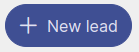
  3. Enter the data in the form.
  4. Click on the save button.
:::

---
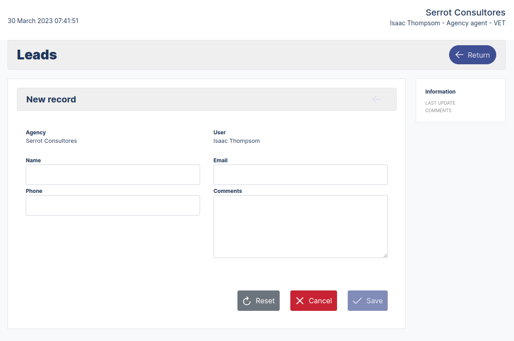

## List view Leads

>The list of Leads view contains the information through a table of the records of the leads.

---

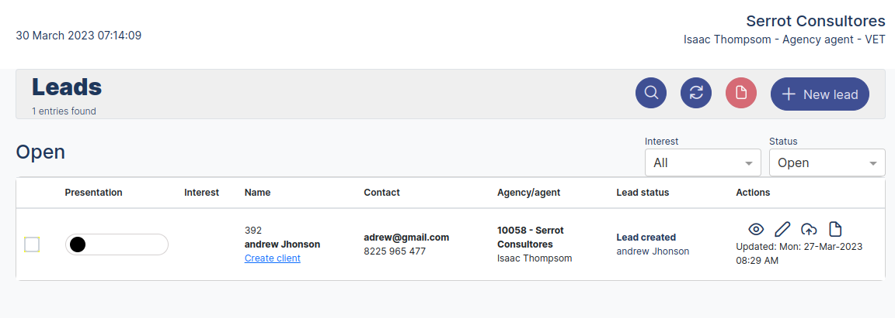

---

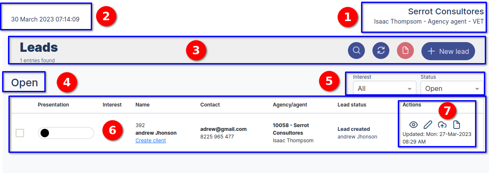

::: info <Badge type="info" text="LEAD LIST VIEW" />
---

**Leads List View**.

 **Interface components:**

1. **Name of the agency, authenticated user and type of user**.
2. **Date and time**.
3. **Module name, number of records and search, refresh, archive, New Lead buttons**.
4. **Shows current status:** open.
5. **Filters of interest:** ("All", "Interested", "Not interested", "Open to conversation")
   status: **("Open","Closed","Archived")**.
6. **Table with the following fields:** Presentation, Interested Party, name, Contact, Agency/Agent, Leads Status.
7. **Actions:** Buttons **("Read","Edit","Upload","Archived")**.

:::

---

### The actions button read, edit, upload , archive

>These buttons perform the actions of reading, editing, archiving, uploading files, in the forms of the different views that are enabled by clicking on each button.

---

---
::: info <Badge type="info" text="ACTIONS BUTTONS" />
---

**Leads List View actions buttons**.

1. **The actions buttons** read, edit, upload , archive.
2. Information of the last update with the date and time of the record.

:::

---

###  Read Button

>Displays the form in read mode, the lead information in a preliminary form.

---

---

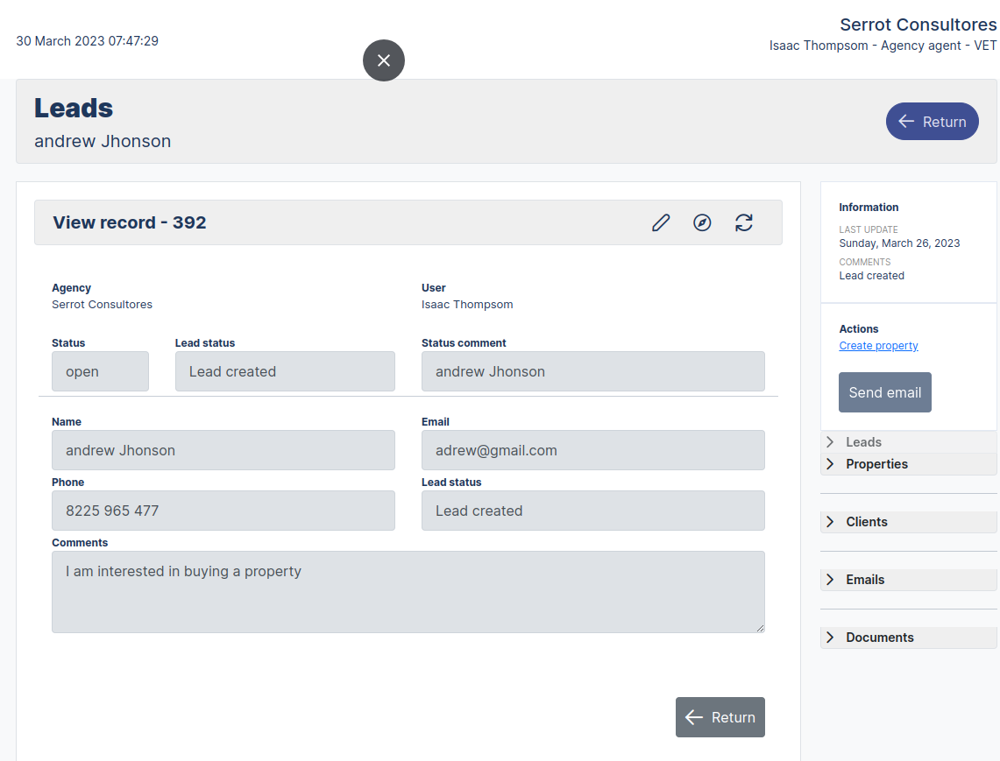

---

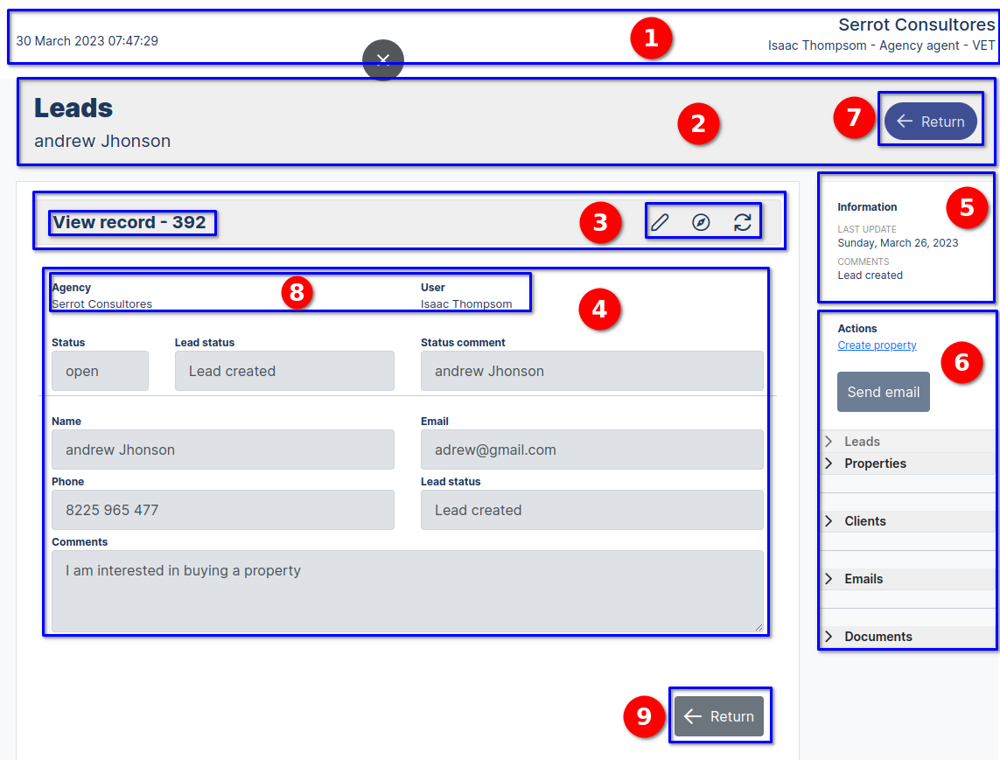

---

::: info <Badge type="info" text="READ FORM" />
---

**Leads List View**.

 **Interface components:**

 1. **Top bar, Agency name, authenticated user and user type, date and time**.
 2. **Module name and lead name**.
 3. **Edit, Refresh, Refresh, Lead ID buttonsLead code: Agency and user name, field name, email, phone, comments**.
 4. **Form with fields disabled in read mode**.
 5. **Information:** Last blog update, comment.
 6. **Auxiliary menu:** Allow to navigate to the system modules.
 7. **Back button**: Back to the prospect list view. form.
 8. **Agency name, authenticated user**.
 9. **Return button**: Returns to the Lead list view. form.

:::

---

### Navigation modules Properties and Emails

>In the Read view of the form we have some auxiliary panels that allow us to navigate to the Properties and mail forms by clicking on the blue button. 

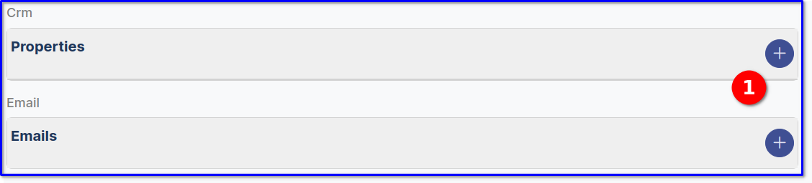

::: info <Badge type="info" text="LEAD FORM" />
---

**Leads List View**.

 **Interface components:**

1. **In the Read form view we have auxiliary panels that allow us to navigate to the Properties and mail forms by clicking on the blue button**.

:::

---

### Edit Button   

>Edit button, directs to the form in the edit view.

---

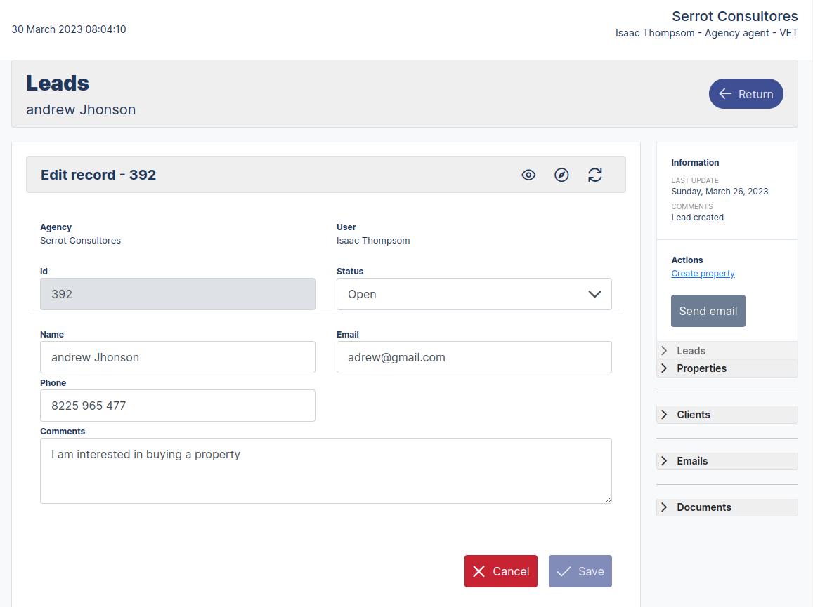

---

::: info <Badge type="info" text="EDIT A LEAD" />

---

To edit a  lead, follow the steps below:

1. Navigate to the pencil-shaped button  and select with a click.
 2. It will display the form in edit view for you to make the changes you need to update.
 3. Enter the data in the form.
 4. Click the Save button.
:::

---

### Upload Archive   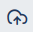

>Upload button, shows the form in read mode, enabling a button for uploading attachments such as documents, images, etc.

---

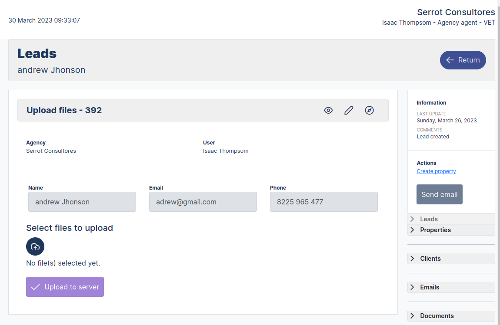

---

::: info <Badge type="info" text="UPLOAD FILES" />

---

To upload a file, follow the steps below:

1. Navigate to the cloud-shaped button  and select it with a click, it will open a dialog box to select the file to upload and attach it.
2. The upload to server button will be enabled. 
 Enter the data in the form.
1. Click on the upload to server button .
:::
---

### Archive Button  

>Archive button its function is to archive the record in order not to be shown in the table, it must be taken into account that it only works with users with higher privileges.
---

# Properties Dashboard Module

## Welcome to the properties page

>Welcome to the **Properties Module** section, this module will contain the information regarding the properties of potential clients.

### Menu - Properties module

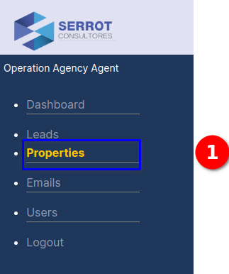

::: info <Badge type="info" text="AGENCY AGENT MENU - PROPERTIES" />
---

 **Menu description:**

1. **Properties module:** To open the properties form we can do it in several ways, navigating in the properties menu or in the main board we select the card
:::

---

### Welcome to the properties dashboard

---

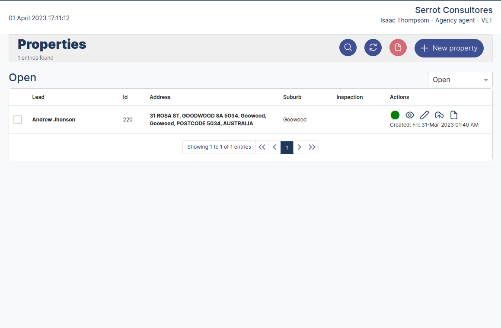

---
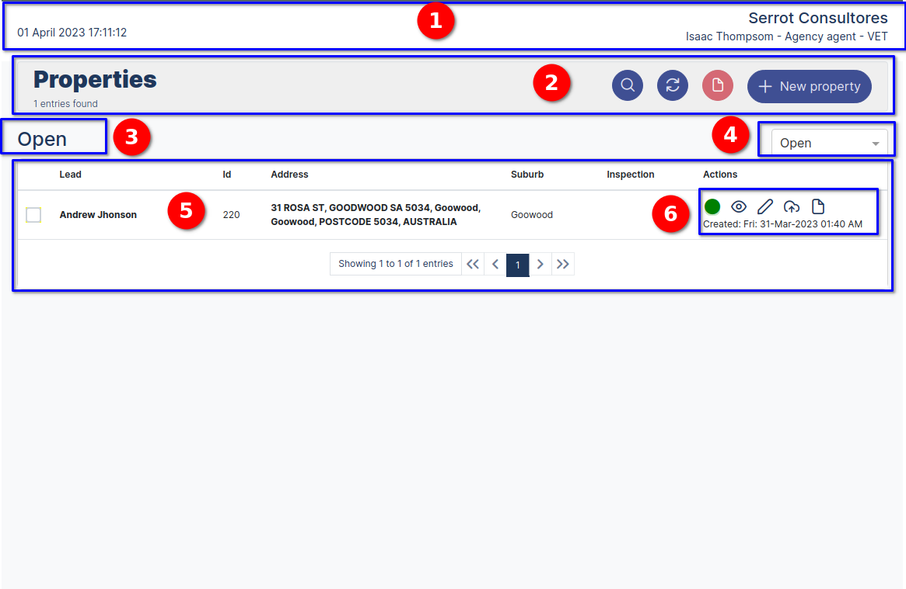

::: info <Badge type="info" text="AGENCY AGENT MENU - PROPERTIES" />
---

**Properties Registration Form**.

* **Form interface components:**

 1. **Top bar, Agency name, authenticated user and user type, date and time**.
 2. **Module name, number of records, search buttons, update, archive, new property**.
 3. **Status:** Open.
 4. **Dropdown**: with options open, closed, archived.
 5. **Table with the address of the contact's property**.
 6. **Action buttons** "Status open green color", Read, edit, upload, archive.

:::

---

### Create a new Propertie

>To create a **new Properties** we go to the dashboard and navigate to **the button New Properties** 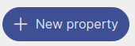by clicking on it, it directs us to the form view to register a new Properties.

### Form to create a new property

---

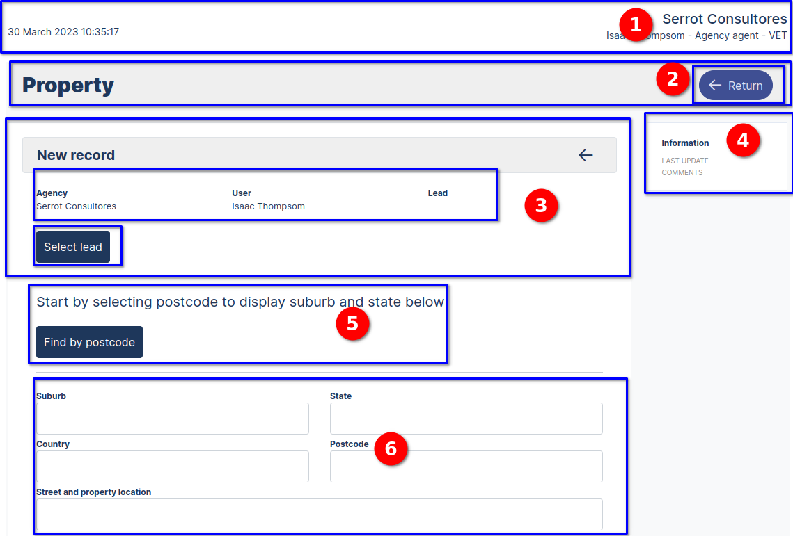

---
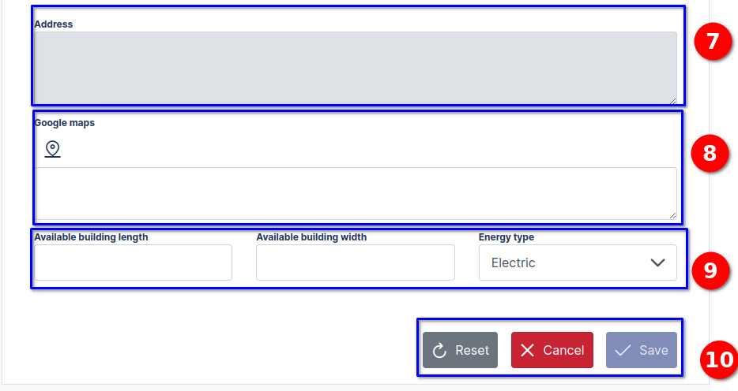

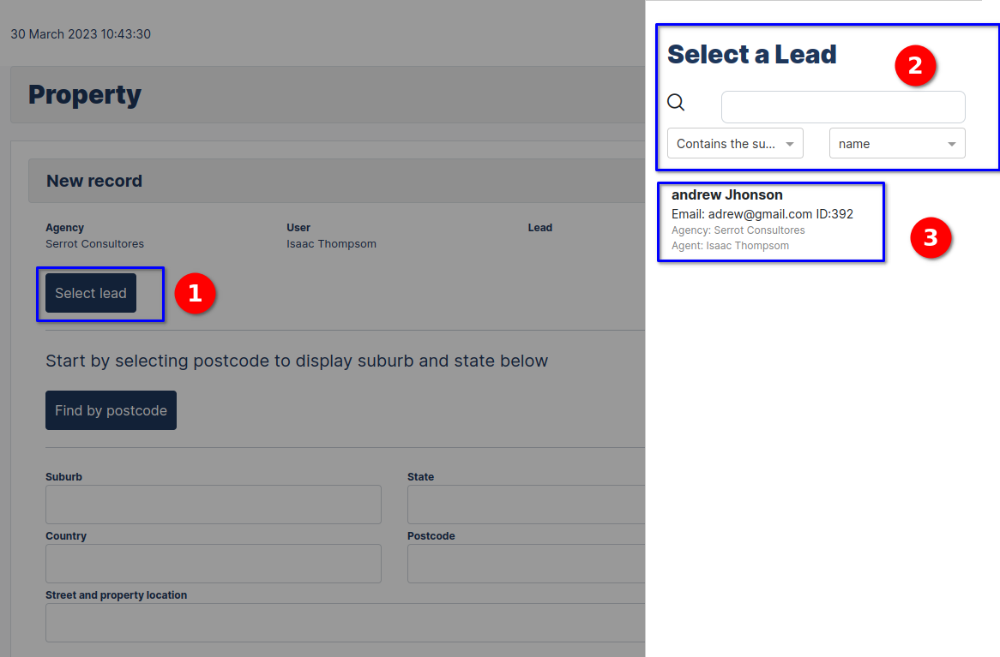

---
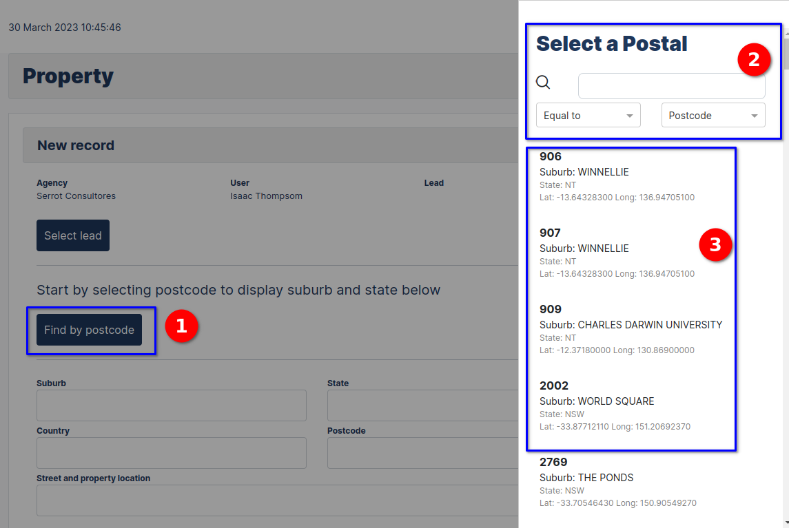

### Create a new Properties

---

::: info <Badge type="info" text="CREATE A NEW PROPERTIES" />

---

**To create a new Properties, follow the steps below:**

  1. Navigate to the main dashboard menu and select the properties link or you can also select the dashboard card with a click.
  2. Select the new Properties button. 
  3. Select Lead
  4. Select a postal
  5. Enter the data in the form.
  6. Click on the save button.
:::

---

### Edit Button   

>Edit button, directs to the form in the edit view.

---

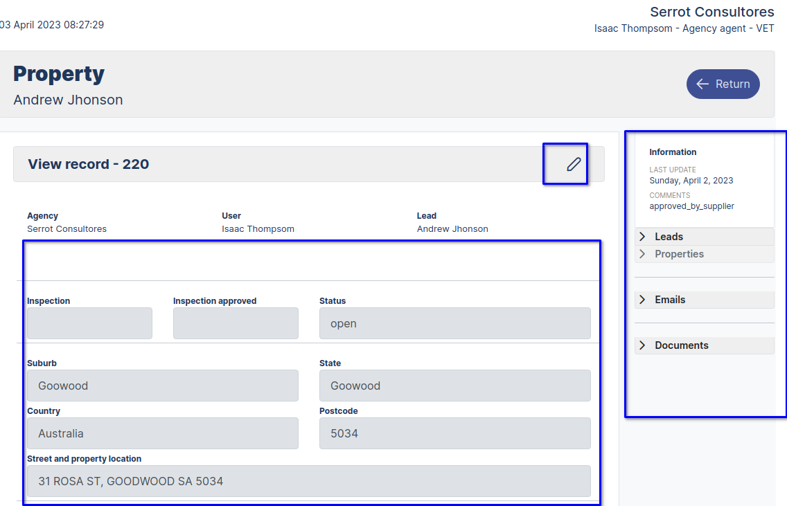

---

---

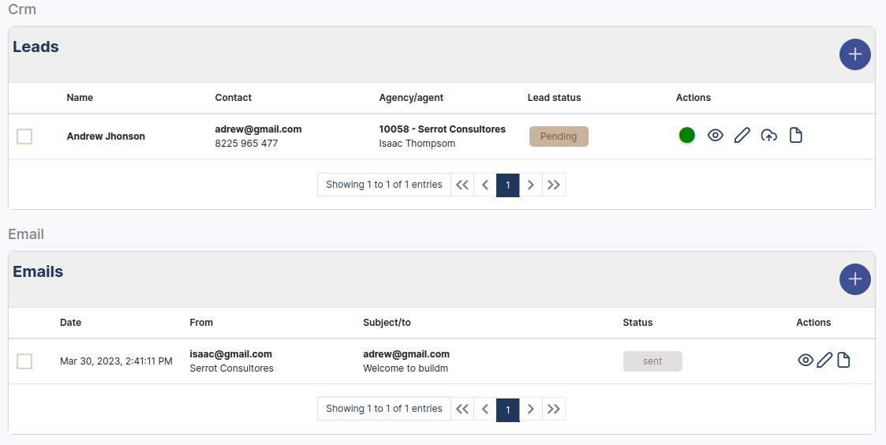

---

::: info <Badge type="info" text="EDIT A PROPERTY" />

---

To edit a  Property, follow the steps below:

1. Navigate to the pencil-shaped button  and select with a click.
 2. It will display the form in edit view for you to make the changes you need to update.
 3. Enter the data in the form.
 4. Click the Save button.
:::

---
### Upload Archive   

>Upload button, shows the form in read mode, enabling a button for uploading attachments such as documents, images, etc.

---

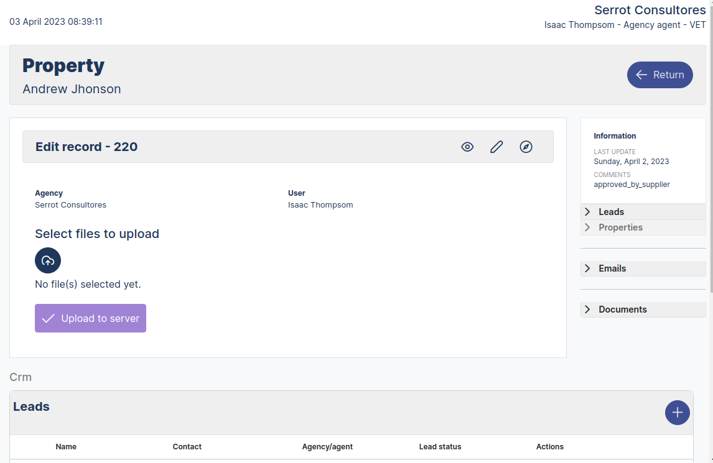

---

::: info <Badge type="info" text="UPLOAD FILES" />

---

To upload a file, follow the steps below:

1. Navigate to the cloud-shaped button  and select it with a click, it will open a dialog box to select the file to upload and attach it.
2. The upload to server button will be enabled. 
 Enter the data in the form.
1. Click on the upload to server button .
:::
---

### Archive Button  

>Archive button its function is to archive the record in order not to be shown in the table, it must be taken into account that it only works with users with higher privileges.
---
# Agency Agent Email Module

### Welcome to the Email module

>Welcome to the Email Module section, this module will contain the information regarding the emails of potential clients.
### Agency Agent Email Menu

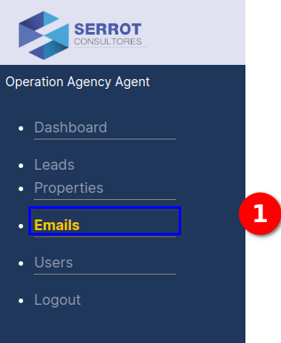

::: info <Badge type="info" text="AGENCY AGENT MENU - EMAILS" />
---
 **Menu description:**

1. **Select the email module**
:::

---

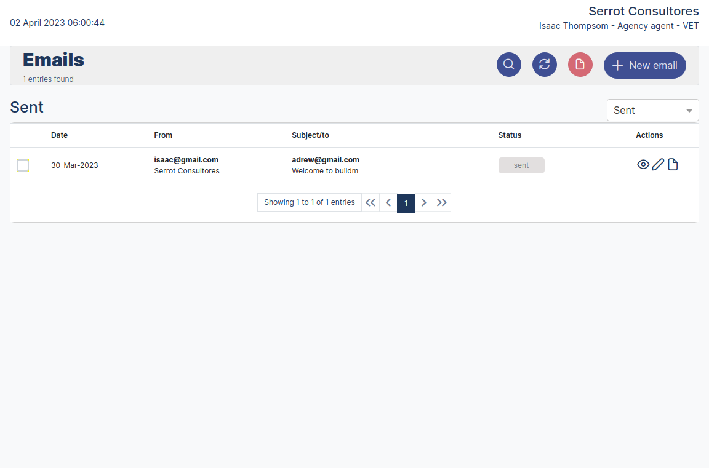

---
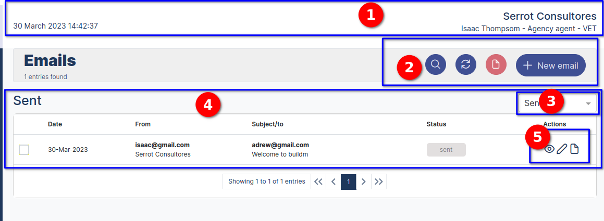

::: info <Badge type="info" text="AGENCY AGENT MENU - EMAILS" />
---

**Emails Registration Form**.

* **Form interface components:**

 1. **Top bar, Agency name, authenticated user and user type, date and time**.
 2. **Module name, number of records, search buttons, update, archive, new property**.
 3. **Status:** Send.
 4. **Dropdown**: with options Send, Draft, archived.
 5. **Table with emails informations**.
 6. **Action buttons** "Status open green color", Read, edit,  archive.

:::

---

### Create a new email

>To create a **new Emails** we go to the dashboard and navigate to **the button New Emails**  by clicking on it, it directs us to the form view to create a new Emails.

### Form to create a new Email

---

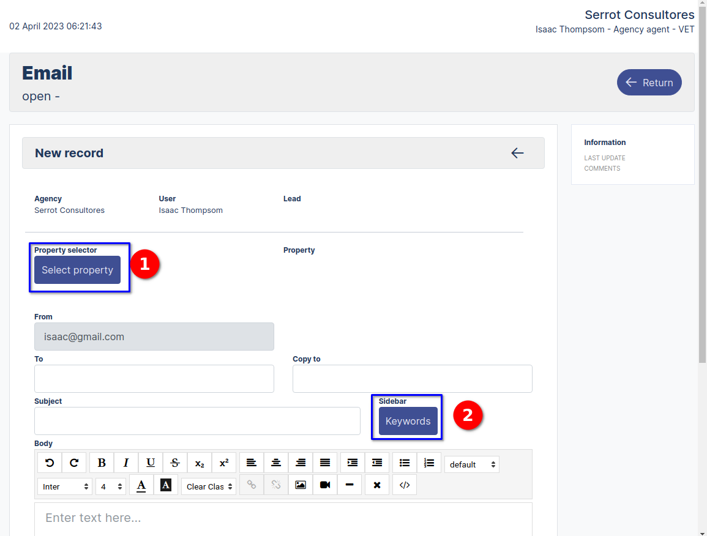

---

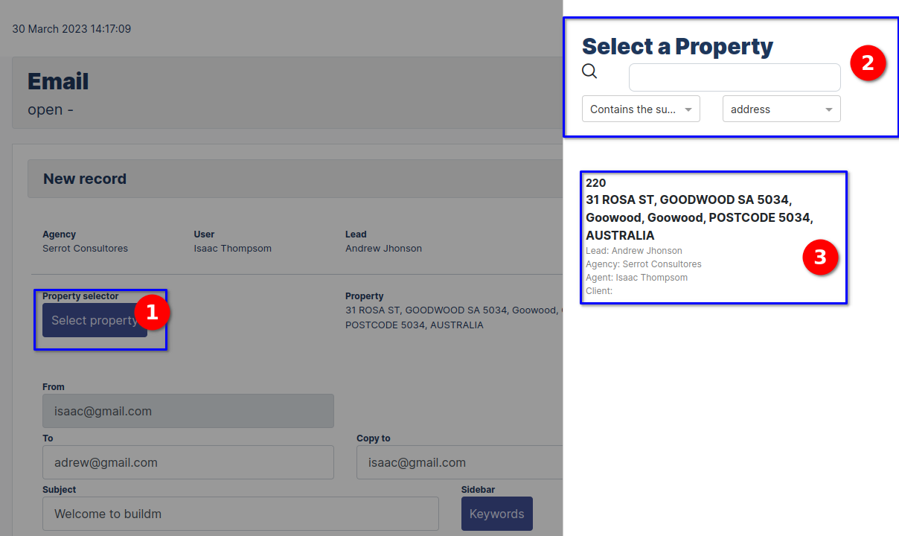

---

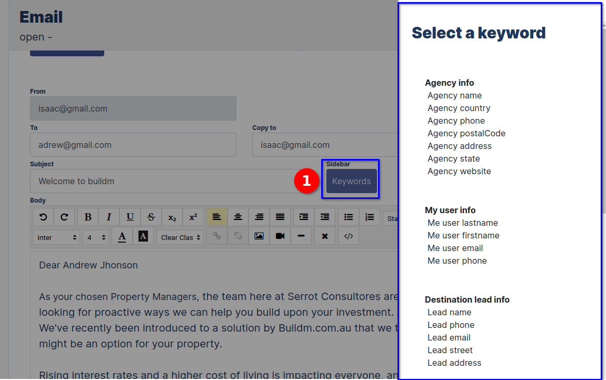

---
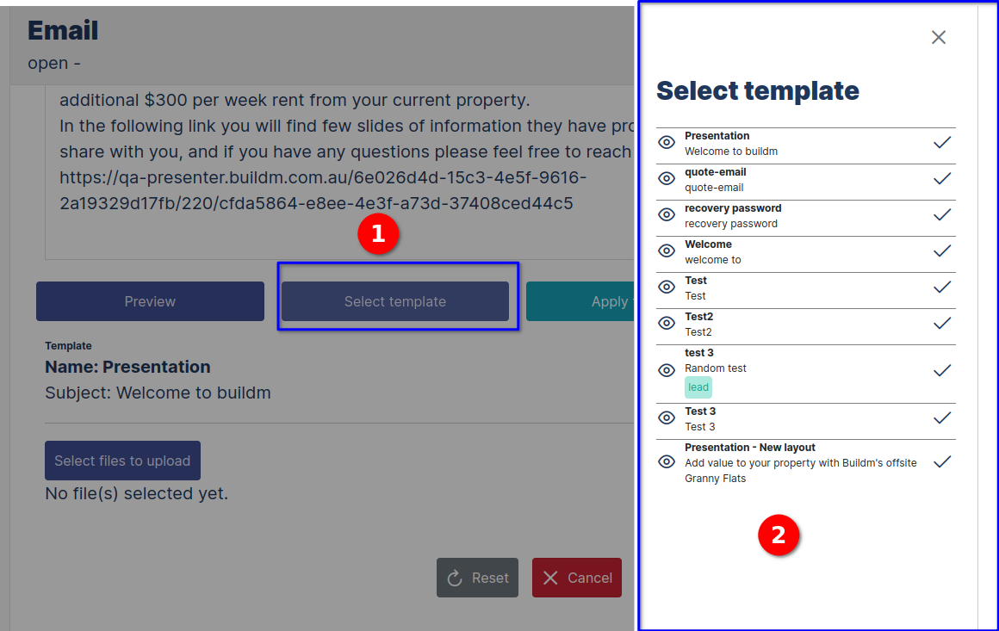

---
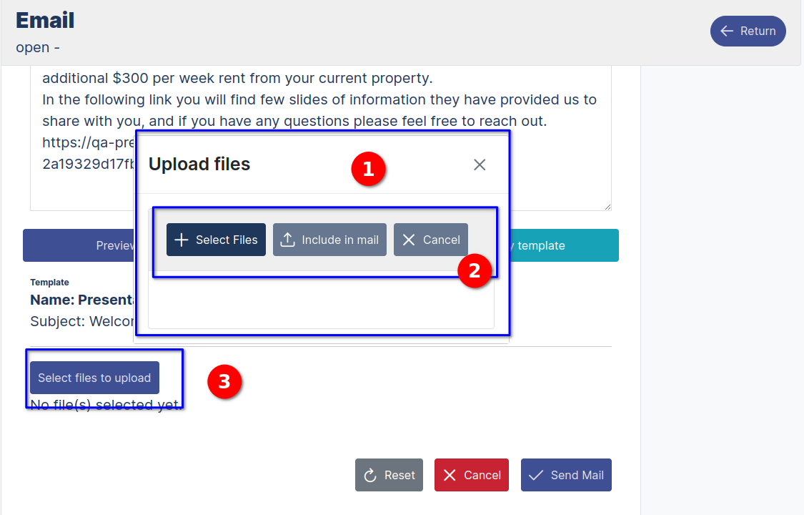

---

::: info <Badge type="info" text="CREATE A NEW EMAIL" />

---

**To create a new Email, follow the steps below:**

  1. Navigate to the main dashboard menu and select the email link with a click. 2.
  2. Select the new email button .
  3. Select a prpoerties.
  4. Select keywords.
  5. Enter the data in the form.
  6. Select a template.
  7. Apply template
  8. Preview.
  9. Select Files to upload.
  10. Click on the send mail button.
:::

### Edit Email

---

### Edit Button   

>Edit button, directs to the form in the edit view.
>**Note:** This interface is only enabled for Corporative users.

---

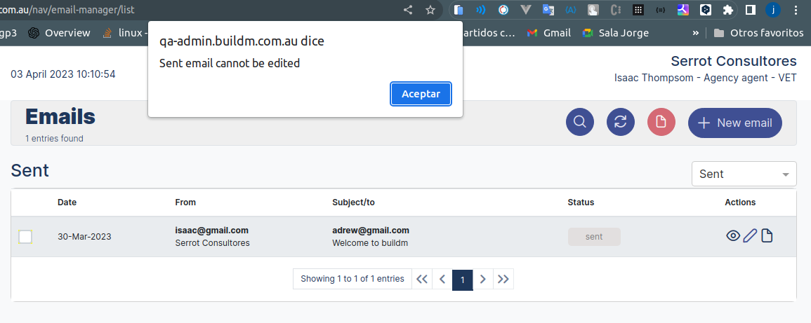

### Archive Button  

>Archive button its function is to archive the record in order not to be shown in the table, it must be taken into account that it only works with users with higher privileges.

## Welcome to the User module
>Welcome to the User Module section, this module will contain the personal information of the users that will enter the application.

---

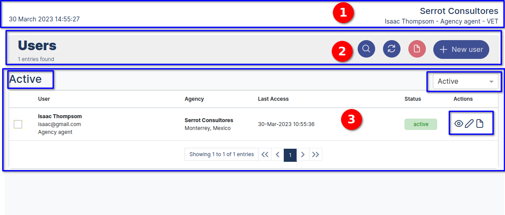

---
::: info <Badge type="info" text="AGENCY AGENT MENU - USERS" />
---

**User Registration Form**.

* **Form interface components:**

 1. **Top bar, Agency name, authenticated user and user type, date and time**.
 2. **Module name, number of records, search buttons, update, archive, new user**.
 3. **Status:** Active.
 4. **Dropdown**: with options Active,Inactive,Invited,Suspended, Draft, archived.
 5. **Table with usres informations**.
 6. **Action buttons** "Status open green color", Read, edit,  archive.

:::

---

### Create a new User

>To create a **New User** go to the main menu by clicking on the User link, it takes us to the list view, locate **the New User button** 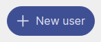 by clicking on it, it takes us to the form view to create a new User.

### Form to create a new User

---

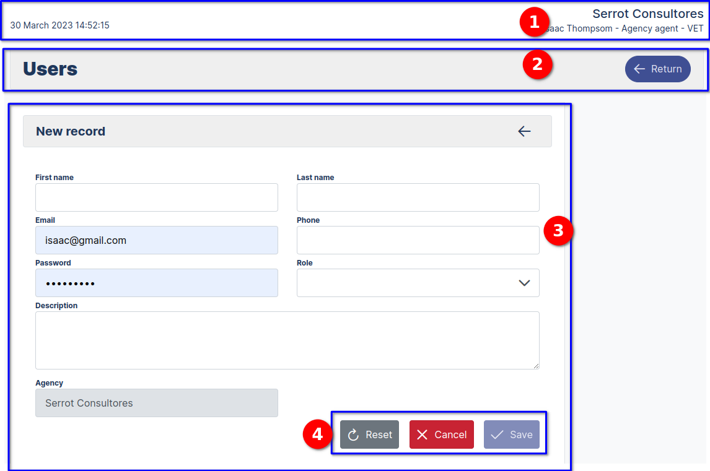

---

::: info <Badge type="info" text="CREATE A NEW USER" />

---

**To create a new User, follow the steps below:**

  1. Navigate to the main dashboard menu and select the user link with a click. 
  2. Select the new user button .
  3. Enter the data in the form.
  4. Click on the save button.
:::

## Edit User

### Edit Button   

>To edit a user: you can access the edit form view in several ways, in the list view by clicking on the pencil icon, it shows the form to edit the data and the other way is as follows.

---

---

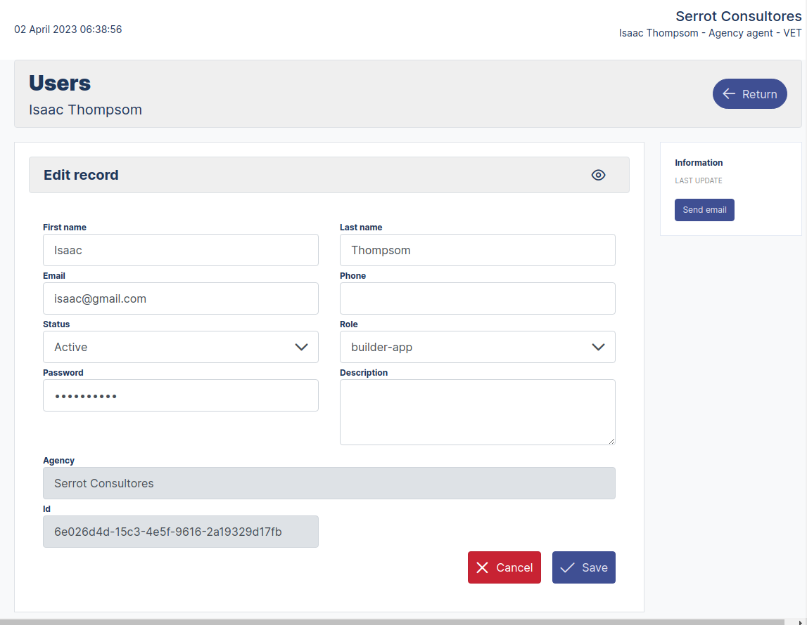

---

::: info <Badge type="info" text="EDIT A USER" />

---

**To edit a User, follow the steps below:**

 1. Navigate to the pencil-shaped button  and select with a click.
 2. It will display the form in edit view for you to make the changes you need to update.
 3. Enter the data in the form.
 4. Click the Save button.
:::

### Archive Button  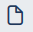

>Archived button its function is to archive the record so that it is not displayed in the table, Allow enabling or disabling a user.

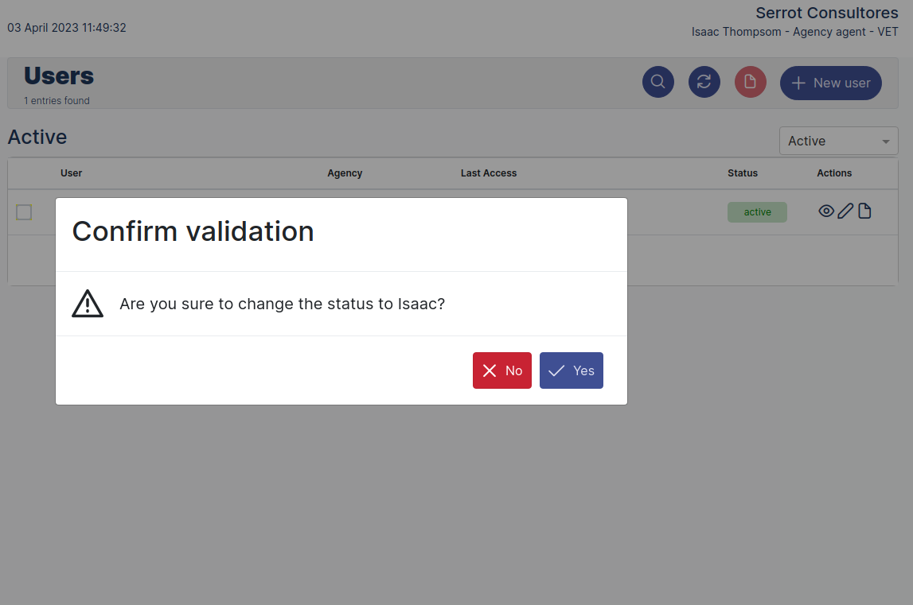

---

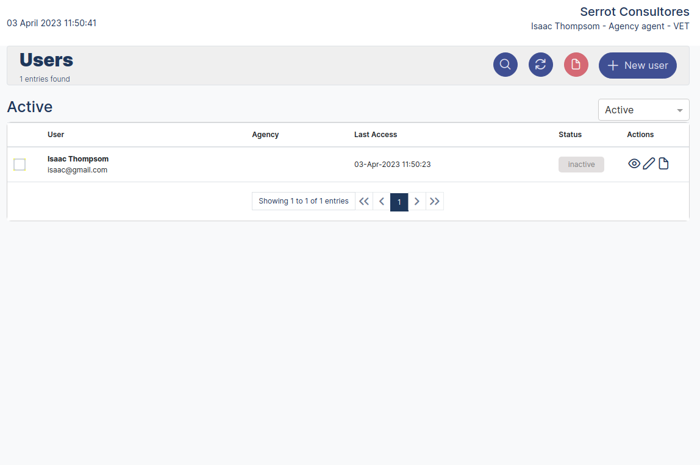

---

---

::: info <Badge type="info" text="DISABLED / ENABLED A USER" />

---

**To enabled / disabled  a User, follow the steps below:**

1. To enable or disable a user just click on the archived button and change the status to active / inactive
  
:::
---

# Exit the system 

>To exit the application navigate to the main menu and click on the logout option.

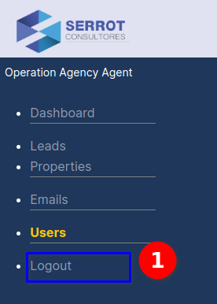
