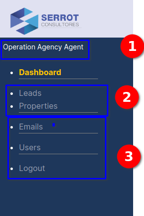
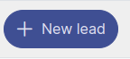
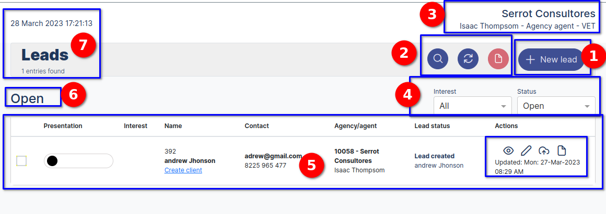
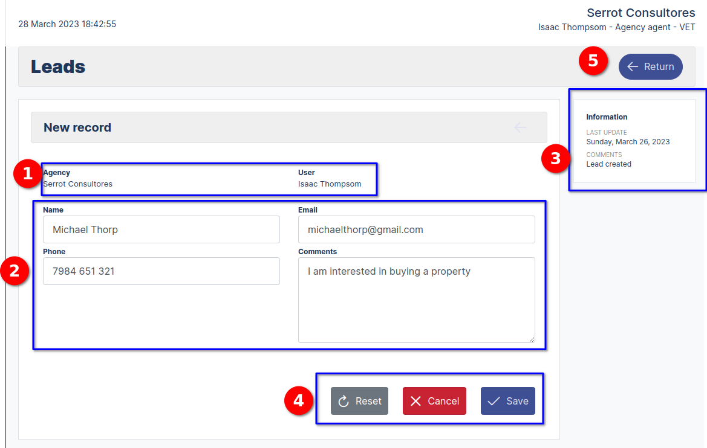
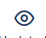
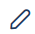

# Agency agent users

## Welcome to the Agent user page

>We are in the **Agent user interface**, where we will learn how to perform the registration process, update, search and archive the different modules that the agent has access to according to their user privilege, the modules are the following (**Leads, Properties, Emails, Users**).

### Agency agent User Menu

::: info <Badge type="info" text="INFO" />
---

**Forgot password view**.
* **Interface elements forgot password:**

  
    1. **Leads:** link to the leads module
    2. **Properties:** link to properties module
    3. **Emails:** link to the e-mail module
    4. **users:** link to the users module
    5. **logout:** close the current session
:::

---

### Agency Agent User Dashboard

::: info <Badge type="info" text="INFO" />
---

**Agency Agent User Dashboard**.
* **Interface elements Agency Agent User Dashboard:**

  
    1. Leads Card Property, has the function of displaying statistics and provides another way to navigate to the referred modules.
    2.  The Operative tab indicates that the module belongs to the operative part of the process.
    3. Filter of the processes that are "open", "closed", "archived".
    4. Update the card information.
    5. Name of the agency and of the logged agent.
    6. Date data.
    7. Name of the module.
:::

---
### Create a new Lead

>Para crear un nuevo Leads nos ubicamos en el dasborad y navegamos hacia el boton  haciendo click, nos dirige hacia la vista del formulario para realizar el alta de un nuevo Leads.

::: info <Badge type="info" text="INFO" />
---

**Dashboard Leads**.
* **Elementos de la interfaz del dashboard:**

  
    1. **Boton New Lead:** Botoón que nos redirige al formulario de registo
    2. **Botones de acciones:** botones de diferentes acciones, buscar, actualizar y archivar
    3. **Nombre de Agencia, Usuario y tipo de usuario:** Etiqueta con los nombres de la agencia, el usuario y tipo de usuario del sistema
    4. **Filtros:** Dropdown interesado con la selección ("Todo","Interesado","No interesado","Abierto a conversar"), Status con las opcione de seleccion ("Abierto","Cerrado","Archivado")
    5. **listado del lead Registrado:** Información de los leads registrados
    6. **Estiqueta el estado:** Información del estado del leads en este caso esta abierto.
    7. **Nombre del modulo:** Muestra información del nombre del modulo, fecha y hora y cantidad de registros.
:::

---

### Formulario para el registro del leads

::: info <Badge type="info" text="INFO" />
---

**Elementos del Formulario**.
* **Interface del formulario de registro:**

  
    1. Nombre de la Agencia y usuario que hace el registro.
    2. Campos nombre, email, telefono, comentarios.
    3. Información adicional sobre la ultima actualización y comentarios.
    4. Botones ("Salvar","Cancelar","Resetear").
    5. Boton Return retorna a la vista listar Leads 
:::

---

### Botones de acciones

.

::: info <Badge type="info" text="INFO" />
---

**Elementos de los Botones de accion**.
* **Acciones de cada botón:**

  
    1. Boton lectura  
    2.  Botont Edit 
    3.  .
    5. Información adicional sobre la ultima actualización y comentarios.
    6. Botones ("Salvar","Cancelar","Resetear").
    7. Boton Return retorna a la vista listar Leads 
:::

---

